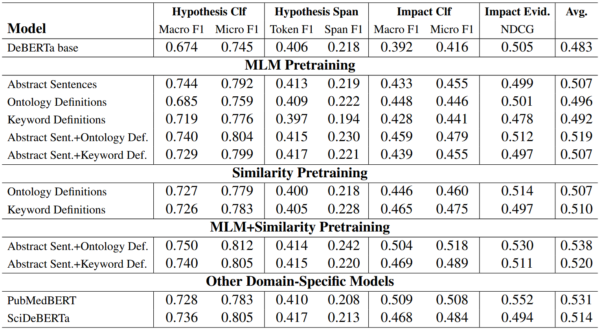

This is the official code repository for the paper:
### Enhancing Domain-Specific Encoder Models with LLM-Generated Data: How to Leverage Ontologies, and How to Do Without Them

Link to the paper: [Click here!]([https://arxiv.org/abs/2510.11599](https://aclanthology.org/2025.findings-emnlp.1238/))

We propose a pre-training strategy for continual pre-training of transformer encoder models in highly specialized domains. This strategy can leverage datasets consisting of domain-relevant concepts accompanied by corresponding concept definitions, which can be either drawn from an ontology (which will be augmented by an LLM) or can be created by an LLM by extracting relevant concepts from a dataset of domain relevant texts. The proposed pre-training strategy then trains the model as embedding model for these concept definitions, which can be combined with traditional MLM pre-training for increased performance.

Our experiments are performed for the target domain of invasion biology.
You can use the two best-performing models like this:

```
from transformers import AutoTokenizer, AutoModel

# Model trained using MLM plus embedding pretraining on ontology concepts
model = AutoModel.from_pretrained("CLAUSE-Bielefeld/InvOntDef-DeBERTa", trust_remote_code=True)
tokenizer = AutoTokenizer.from_pretrained("CLAUSE-Bielefeld/InvOntDef-DeBERTa")

# Model trained using MLM plus embedding pretraining on LLM-extracted concepts
model = AutoModel.from_pretrained("CLAUSE-Bielefeld/InvDef-DeBERTa", trust_remote_code=True)
tokenizer = AutoTokenizer.from_pretrained("CLAUSE-Bielefeld/InvDef-DeBERTa")

```

The model is a standard transformer encoder, so that it can be used within all standard workflows that incorporate transformer encoder models from the transformers library.

## Datasets

This repository contains the pretraining datasets used in our experiments. These are the following:

1. A dataset of unlabeled scientific abstracts from the field of invasion biology (data/datasets/INAS_dataset/unlabeled abstracts).
2. Concepts extracted from two ontologies (ENVO and INBIO) with four additional LLM-generated definitions (data/datasets/processed_datasets/ontology_definition_dataset.json)
3. Concepts extracted from the scientific abstracts using an LLM (data/datasets/processed_datasets/unlabeled_keywords)
4. Concept definitions for the LLM-extracted keywords (data/datasets/processed_datasets/unlabeled_definitions)

We evaluate or pretraining strategies on a benchmark consisting of four tasks from the domain of invasion biology, covering classification, information extraction and ranking.
The data for two of the tasks is included in this repository, while the other can only possibly be handed out on request and for research purposes, since it contains copyrighted materials (i.e., full-text papers).

## Evaluation Results

The main advantage of our pretraining strategy is the reduction of reliance on large datasets for MLM pretraining. We show that, on a dataset of 5000 scientific abstracts, our strategy of incorporating LLM-augmented ontology-derived data improves downsteam performance.
Further, we can replace the ontology-derived dataset with a completely LLM-generated dataset that is based on the same dataset of 5000 scientific abstracts, which also leads to improved performance over just doing MLM pretraining (even though the ontology-derived dataset performs slightly better).

These are the evaluation results:



## Performing Experiments and Evaluations

This repository contains all necessary files for running our experiments and evaluations (except for the EICAT data).

The `main.py` contains two methods that explain how to 1) generate our LLM-augmented datasets and 2) run our pretraining and evaluations.
The content of this methods should be self-explanatory. Just set the if check for the part you want to run to `True` and run `main.py` without any arguments.

### Citation
```bibtex
@inproceedings{brinner-etal-2025-enhancing,
    title = "Enhancing Domain-Specific Encoder Models with {LLM}-Generated Data: How to Leverage Ontologies, and How to Do Without Them",
    author = "Brinner, Marc Felix  and
      Al Mustafa, Tarek  and
      Zarrie{\ss}, Sina",
    editor = "Christodoulopoulos, Christos  and
      Chakraborty, Tanmoy  and
      Rose, Carolyn  and
      Peng, Violet",
    booktitle = "Findings of the Association for Computational Linguistics: EMNLP 2025",
    month = nov,
    year = "2025",
    address = "Suzhou, China",
    publisher = "Association for Computational Linguistics",
    url = "https://aclanthology.org/2025.findings-emnlp.1238/",
    doi = "10.18653/v1/2025.findings-emnlp.1238",
    pages = "22740--22754",
    ISBN = "979-8-89176-335-7"
}
```

